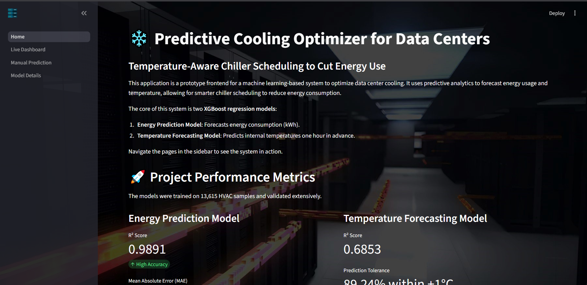

# தரவு மையங்களுக்கான முன்கணிப்பு குளிரூட்டல் மேம்பாடு: வெப்பநிலை அடிப்படையிலான சில்லர் திட்டமிடல் மூலம் ஆற்றல் நுகர்வைக் குறைத்தல்

[English](README.md) | தமிழ் | [中文](README_ZH.md) | [हिन्दी](README_HI.md) | [Bahasa Indonesia](README_ID.md)


[](LICENSE)


இந்தத் திட்டம், தரவு மையங்களின் குளிரூட்டல் அமைப்புகளில் காணப்படும் ஆற்றல் திறனின்மையைத் தீர்க்கும் நோக்கில் உருவாக்கப்பட்டுள்ளது. வெப்பநிலையை அடிப்படையாகக் கொண்டு முன்கணிப்பு செய்யும் ஒரு மாதிரியை உருவாக்கி, சில்லர்களின் செயல்பாட்டு திட்டமிடலை மேம்படுத்துவதன் மூலம் ஆற்றல் நுகர்வைக் குறைப்பதோடு, வெப்பநிலை பாதுகாப்பு வரம்புகளையும் பராமரிக்கிறது. பாரம்பரிய எதிர்வினை அடிப்படையிலான குளிரூட்டல் அமைப்புகள் வெப்பநிலை மாற்றம் ஏற்பட்ட பிறகே அதற்கு பதிலளிக்கின்றன. இதனால் ஆற்றல் வீணாகுவதுடன், சில்லர்களின் செயல்பாடும் திறனற்றதாகிறது.



## திட்டத்தின் செயல்முறை

இந்த செயல்முறை 13,615 HVAC மாதிரிகளை உள்ளடக்கிய விரிவான தரவு முன்செயலாக்கத்துடன் தொடங்கியது. இதில் IQR முறையைப் பயன்படுத்தி வெளிப்புற மதிப்புகள் கண்டறியப்பட்டன, MinMaxScaler மூலம் தரவுகள் இயல்புநிலைப்படுத்தப்பட்டன, மேலும் காலவரிசைத் தொடர்ச்சியைப் பாதுகாக்க 80-20 காலவரிசை அடிப்படையிலான பயிற்சி மற்றும் சோதனைத் தரவுப் பிரிப்பு மேற்கொள்ளப்பட்டது.

அம்சப் பொறியியல் மூலம் மொத்தம் 46 மேம்படுத்தப்பட்ட அம்சங்கள் உருவாக்கப்பட்டன. இதில் 16 lag அம்சங்கள், 12 rolling average அம்சங்கள், 6 cyclical temporal encoding அம்சங்கள் மற்றும் 4 interaction அம்சங்கள் அடங்கும். இவை அமைப்பின் சிக்கலான இயக்கநிலைகளைப் பிரதிபலிக்க உதவுகின்றன.

இரண்டு XGBoost regression மாதிரிகள் முக்கிய முன்கணிப்பு இயந்திரமாகப் பயன்படுத்தப்பட்டன. 
- ஆற்றல் முன்கணிப்பு மாதிரி R² = 0.9891 மற்றும்,
-  MAE = 1.222 kWh ஆகிய செயல்திறன் மதிப்புகளைப் பெற்றது.
-  வெப்பநிலை முன்கணிப்பு மாதிரி R² = 0.6853 மதிப்பையும், ±1°C துல்லிய வரம்பிற்குள் 89.24% முன்கணிப்புகளையும் பெற்றது.

இரு மாதிரிகளும் திறமையான பயிற்சி நேரத்தைக் கொண்டிருந்தன. ஆற்றல் மாதிரிக்கான பயிற்சி நேரம் 2.12 வினாடிகளும், வெப்பநிலை மாதிரிக்கான பயிற்சி நேரம் 1.87 வினாடிகளும் ஆகும். இதனால் இம்மாதிரிகள் நிகழ்நேரப் பயன்பாட்டிற்கு ஏற்றவையாக உள்ளன.

`PredictiveCoolingOptimizer` class இந்த இரண்டு மாதிரிகளையும் ஒருங்கிணைக்கிறது. இதன் மூலம் வெப்பநிலையை கட்டுப்படுத்துவதற்கான கட்டுப்பாட்டு நிபந்தனைகள் மற்றும் ஆற்றல் நுகர்வைக் குறைக்கும் உத்திகளைப் பயன்படுத்தி முழு அமைப்பின் குளிரூட்டல் செயல்பாட்டையும் மேம்படுத்த முடிகிறது.

## சோதனை

மொத்தம் ஐந்து வகைகளில் 11 சோதனைகள் மேற்கொள்ளப்பட்டுள்ளன. அவற்றின் விவரங்கள் பின்வருமாறு:

|      சோதனைகள்     |                               இலக்கு                              |   நிலை   |
| :---------------------: | :-----------------------------------------------------------------: | :------: |
| Unit Tests              | ஆற்றல் மற்றும் வெப்பநிலை மாதிரிகள், மேம்படுத்தல் இயந்திரம் | ✅ தேர்ச்சி |
| Integration Tests       | End-to-End Pipeline, System Integration                             | ✅ தேர்ச்சி |
| Functional Tests        | துல்லியம், பதில் நேரம் மற்றும் செயல்பாட்டு தர்க்கம்             | ✅ தேர்ச்சி |
| White Box Test          | Hyperparameters, Feature Engineering                                | ✅ தேர்ச்சி |
| Black Box Test          | Boundary Values, Output Consistency                                 | ✅ தேர்ச்சி |
|                         | வெற்றிகரமாக முடிக்கப்பட்ட சோதனைகள்                        |  11/11      |
|                         | தோல்வியடைந்த சோதனைகள்                                    |  0/11       |
|                         | வெற்றி விகிதம்                                                    | 100.0%      |

## செயல்படுத்தும் நடைமுறை

இந்த நிரலை இயக்கும் செயல்முறை மிகவும் எளிமையானது. கீழே கொடுக்கப்பட்டுள்ள படிகளைப் பின்பற்றலாம்.

1. தேவையான libraries-ஐ நிறுவவும்:

```bash
pip install xgboost streamlit
```

2. Command Prompt அல்லது PowerShell மூலம் திட்டக் கோப்புறைக்குச் செல்லவும்:

```bash
cd <your-file-path>
```

3. கீழ்க்கண்ட கட்டளையைப் பயன்படுத்தி பயன்பாட்டை இயக்கவும்:

```bash
streamlit run 1_Home.py
```

## பயன்படுத்தப்பட்ட கருவிகள்

1. Anaconda Jupyter - மாதிரி பயிற்சி மற்றும் சோதனைக்காக
2. Streamlit library - frontend செயல்படுத்தலுக்காக
3. Joblib - `.pkl` மாதிரி கோப்புகளை கையாள்வதற்காக
4. NumPy
5. Pandas
6. Scikit-Learn
7. XGBoost

## பயன்படுத்தப்பட்ட அல்காரிதம்கள்

### 1. முன்கணிப்பு அல்காரிதம்கள்

* XGBoost (Extreme Gradient Boosting)
* Random Forest Regressor

### 2. துணை அல்காரிதம்கள்

* Min-Max Normalization
* Rolling Average (feature engineering-க்காக)

இந்தக் கருவி, மென்பொருள் அடிப்படையிலான முன்கணிப்பு குளிரூட்டல் மேம்படுத்தலின் செயல்திறன் மற்றும் நடைமுறை சாத்தியத்தை வெற்றிகரமாக நிரூபிக்கிறது. மேலும், Streamlit பயன்படுத்தி உருவாக்கப்பட்ட ஊடாடும் வலைப் பயன்பாடுகள் மூலம் பயன்படுத்தத்தக்க வகையில் மாதிரிகள் தயார் நிலையில் உள்ளன. இதனால் பயனர்கள் மற்றும் தொடர்புடைய தரப்பினருக்கான விளக்கக்காட்சி மற்றும் பயன்பாடும் எளிதாகிறது.

## உரிமம்

இந்தத் திட்டம் MIT License-ன் கீழ் உரிமம் பெற்றுள்ளது. விவரங்களுக்கு [LICENSE](LICENSE) கோப்பைப் பார்க்கவும்.

